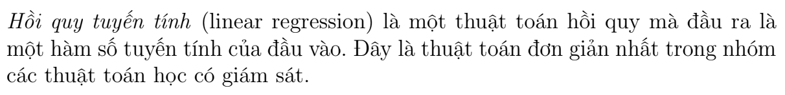
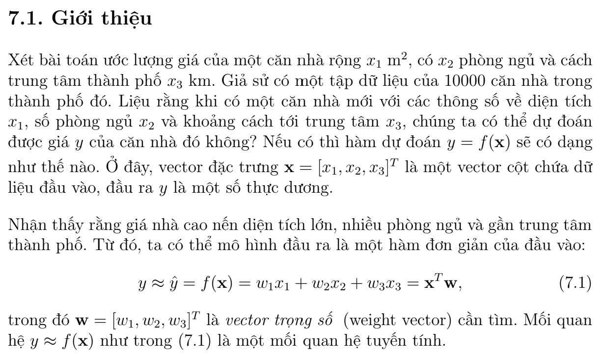

# Hồi Quy Tuyến Tính (Linear Regression)

## 1. Định nghĩa

Bài toán trên đây là bài toán dự đoán giá trị của đầu ra dựa trên vector đặc
trưng đầu vào. Ngoài ra, giá trị của đầu ra có thể nhận rất nhiều giá trị thực
dương khác nhau. Vì vậy, đây là một bài toán hồi quy. Mối quan hệ $\hat{y} = \mathbf{x}^T \mathbf{w}$ là một mối quan hệ tuyến tính. Tên gọi hồi quy tuyến tính xuất phát từ đây.

---

## 2. Loss Function: Xây dựng và Tối ưu hóa
### 2.1. Định nghĩa

Tổng quát, nếu mỗi điểm dữ liệu được mô tả bởi một *vector đặc trưng* $d$ chiều $\mathbf{x} \in \mathbb{R}^{d}$, hàm dự đoán đầu ra được viết dưới dạng:

$$
y = w_1x_1 + w_2x_2 + ... + w_dx_d = \mathbf{x}^{T}\mathbf{w} \qquad (7.2)
$$

---

### 2.2. Sai số dự đoán
Sau khi xây dựng được mô hình dự đoán đầu ra như (7.2), ta cần tìm một phép
đánh giá phù hợp với bài toán. Với bài toán hồi quy nói chung, ta mong muốn sự
sai khác e giữa đầu ra thực sự $y$ và đầu ra dự đoán $\hat{y}$ là nhỏ nhất:

$$
\frac{1}{2} e^{2} = \frac{1}{2}(y - \hat{y})^{2} = \frac{1}{2}(y - \mathbf{x}^{T}\mathbf{w})^{2} \qquad (7.3)
$$

Ở đây, bình phương được lấy vì $e = y − \hat{y}$ có thể là **một số âm**. Việc sai số là nhỏ nhất có thể được mô tả bằng cách lấy trị tuyệt đối $|e| = |y − \hat{y}|$. Tuy nhiên, cách làm này ít được sử dụng vì hàm trị tuyệt đối không khả vi tại gốc toạ độ, không thuận tiện cho việc tối ưu (thường là sử dụng Gradient). Hệ số $\frac{1}{2}$ sẽ bị triệt tiêu khi lấy đạo hàm của $e$ theo tham số mô hình $\mathbf{w}$.

### 2.3. Hàm mất mát
Điều tương tự xảy ra với tất cả các cặp dữ liệu $(x_i, y_i), i = 1, 2, . . . , N$, với $N$ là số lượng dữ liệu trong tập huấn luyện. Việc tìm mô hình tốt nhất tương đương với việc tìm $w$ để hàm số sau đạt giá trị nhỏ nhất:

$$
\mathcal{L(\mathbf{w})} = \frac{1}{2N} \sum_{i=1}^{N}(y_i - \mathbf{x_i}^{T}\mathbf{w}) \qquad (7.4)
$$

Hàm số $\mathcal{L(w)}$ chính là hàm mất mát của mô hình hồi quy tuyến tính với tham số $θ = w$. Ta luôn mong muốn sự mất mát là nhỏ nhất, điều này có thể đạt được
bằng cách tối thiểu hàm mất mát theo $w$:

$$
\mathbf{w}^{*} = \operatorname*{argmin}_{\mathbf{w}} \mathcal{L}(\mathbf{w}) \qquad (7.5)
$$

> [!NOTE]
> Trong machine learning, hàm mất mát thường là trung bình cộng của sai số tại mỗi điểm. Về mặt toán học, hệ số $\frac{1}{2N}$ không ảnh hưởng tới nghiệm của bài toán. Tuy nhiên, việc lấy trung bình này quan trọng vì số lượng điểm dữ liệu trong tập huấn luyện có thể thay đổi. Việc tính toán mất mát trên từng điểm dữ liệu sẽ hữu ích hơn trong việc đánh giá chất lượng mô hình. Ngoài ra, việc lấy trung bình cũng giúp tránh hiện tượng tràn số khi số lượng điểm dữ liệu lớn.

Trước khi xây dựng nghiệm cho bài toán tối ưu hàm mất mát, ta thấy rằng hàm số này có thể được viết gọn lại dưới dạng ma trận, vector, và norm như sau:

$$
\mathcal{L(\mathbf{w})} = \frac{1}{2N}\sum_{i=1}^{N}(y_i - \mathbf{x_i}^{T}\mathbf{w})^{2} = \frac{1}{2N} \left\| \begin{bmatrix} y_1 - \mathbf{x_1}^{T}\mathbf{w} \\ y_2 - \mathbf{x_2}^{T}\mathbf{w} \\ ... \\ y_N - \mathbf{x_N}^{T}\mathbf{w}\end{bmatrix} \right\|_2 ^{2} = \frac{1}{2N} \left\| \begin{bmatrix} y_1 \\ y_2 \\ ... \\ y_N\end{bmatrix} - \begin{bmatrix} \mathbf{x_1}^{T} \\ \mathbf{x_2}^{T} \\ ... \\ \mathbf{x_N}^{T}\end{bmatrix} \mathbf{w}\right\|_2^{2} = \frac{1}{2N} \left \| \mathbf{y} - \mathbf{X}^{T}\mathbf{w} \right \|_2^{2}
$$

Trong đó:

$$
\mathbf{X}^{T} = \begin{bmatrix} \mathbf{x_1}^{T} \\ \mathbf{x_2}^{T} \\ ... \\ \mathbf{x_N}^{T}\end{bmatrix} \Rightarrow \mathbf{X} = \begin{bmatrix} \mathbf{x_1} & \mathbf{x_2} & ... & \mathbf{x_N}\end{bmatrix}
$$

$$
\mathbf{y} = \begin{bmatrix} y_1 \\ y_2 \\ ... \\ y_N\end{bmatrix}
$$

$\left\| x \right\|_2$

