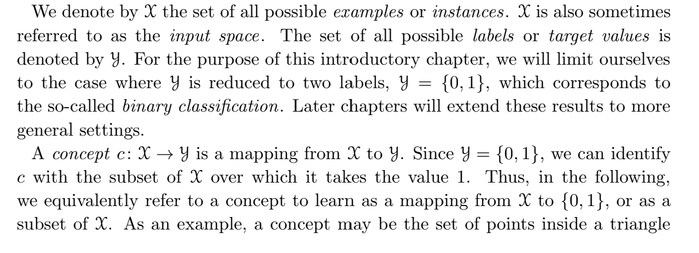
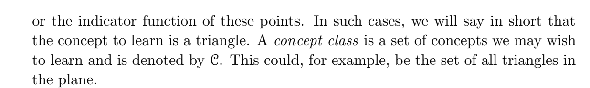
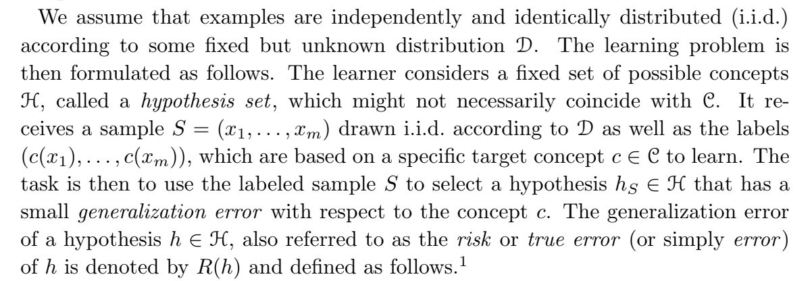
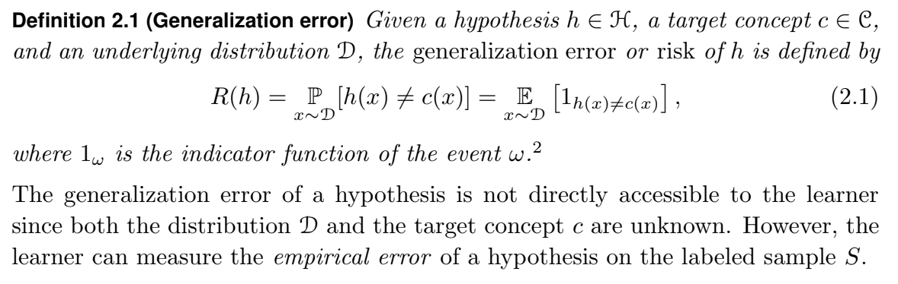
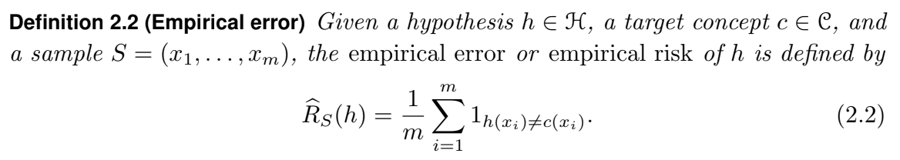
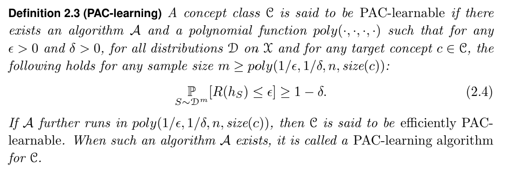
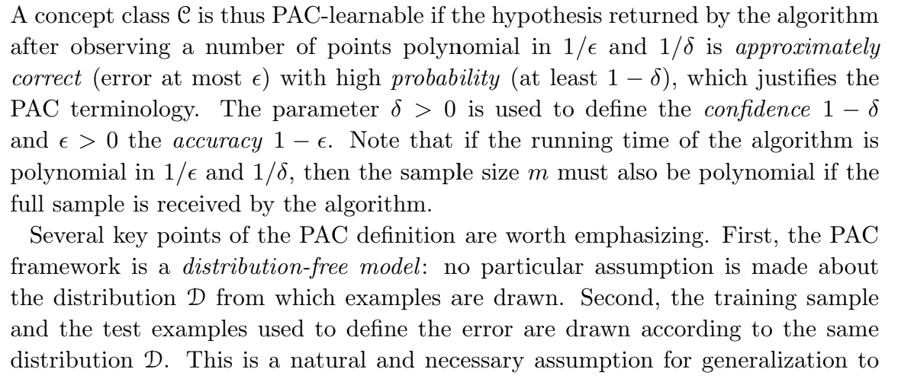
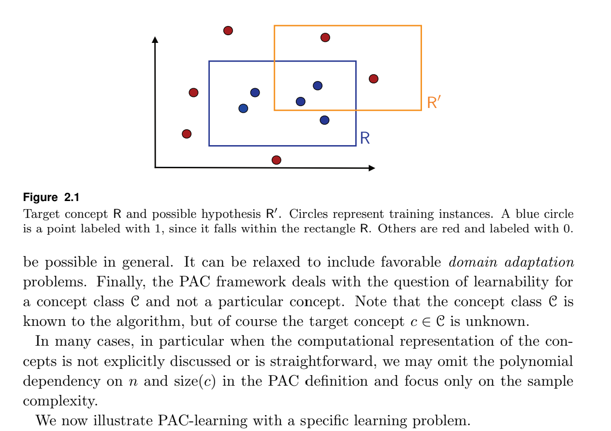

# 1. Introduction

Several fundamental questions arise when designing and analyzing algorithms that
learn from examples: What can be learned efficiently? What is inherently hard to learn? How many examples are needed to learn successfully? Is there a general model of learning?

The PAC framework helps define the class of learnable concepts in terms of the number of sample points needed to achieve an approximate solution, sample complexity, and the time and space complexity of the learning algorithm, which depends on the cost of the computational representation of the concepts.

# 2. Definition of PAC Learning Model

Tóm tắt lại một tí:

- Ta có $\mathcal{X}$ là một tập hợp tất cả các examples hoặc instances.
- $\mathcal{Y}$ là một tập các labels hoặc target values. Trong bài này ta chỉ sử dụng tập $\mathcal{Y} = \{0, 1\}$
- $\mathcal{C}$ là concept class (lớp khái niệm) có cấu tạo bao gồm không gian đầu vào $\mathcal{X}$ và một quy tắc nào đó giúp ta mapping các examples trong ko gian $\mathcal{X}$ vào tập target values $\mathcal{Y}$.

Một ví dụ trực quan về PAC-learning:

- **Bài toán phân loại mèo bằng hình chữ nhật trên đồ thị.**
    - Giả sử dữ liệu là tọa độ $(x, y)$ của các con vật.
    - Một **khái niệm** $c$ cụ thể có thể là: "Nếu tọa độ nằm trong hình chữ nhật từ góc $(0,0)$ đến $(5,5)$ thì đó là mèo (1), ngược lại là chó (0)".
    - **Lớp khái niệm** $\mathcal{C}$ ở đây sẽ là *tập hợp tất cả các hình chữ nhật có cạnh song song với trục tọa độ* với mọi kích thước và vị trí. Thuật toán PAC-learning phải chứng minh được nó có thể tìm ra một hình chữ nhật xấp xỉ đúng với hình chữ nhật thật, cho dù hình chữ nhật thật đó nằm ở đâu.
- **Phân loại email rác bằng từ khóa.**
    - Một **khái niệm** $c$ có thể là: "Nếu email chứa từ 'trúng thưởng' VÀ 'miễn phí', đó là thư rác".
    - **Lớp khái niệm** $\mathcal{C}$ có thể là tập hợp *tất cả các công thức logic hội* (AND) ghép từ một tập từ vựng cho trước.
- **Mô hình học máy hiện đại.**
    - $\mathcal{C}$ có thể là tập hợp tất cả các hàm toán học biểu diễn được bởi một mạng nơ-ron có 3 lớp ẩn (3-hidden-layer Neural Networks).
    - $\mathcal{C}$ có thể là tập hợp tất cả các Cây quyết định (Decision Trees) có độ sâu tối đa là 5.

Cách nói $\mathcal{H}$ còn có thể được hiểu là toàn bộ những thuật toán máy học mà ta muốn chạy thực nghiệm với bộ dữ liệu $\mathcal{X}$. (Có thể sang page về Bias-Variance Decomposition để hiểu thêm về cách định nghĩa của Hypothesis set)

## Definition 2.1 (Generalization error)

Nhớ lại một chút trong page về hoeffding’s inequality có nhắc về $Err_{real}(f_\theta)$ như sau:

$$
Err_{real} = E[z_i] = p = P(f_\theta(x) \neq y) \qquad(1)
$$

Trong đó $p$ là xác suất mà mô hình dự đoán sai tại một điểm dữ liệu trong thực tế, $z_i$ là một biến ngẫu nhiên ta định nghĩa như sau

$$
z_i = \mathbb{I}[f_\theta(x) \neq y] = \begin{cases}1, \text{ nếu thỏa điều kiện} \\ 0, \text{ nếu không thỏa điều kiện}\end{cases}
$$

Định nghĩa của $Err_{test}$ hoàn toàn tương đương với định nghiax (2.1). Tuy nhiên, ở định nghĩa về $Err_{real}$ ta chỉ nhắc về một trường hợp trong hypothesis set, trong khi đó số lượng hypothesis mà ta cần dùng có thể nhiều hơn, nên trong định nghĩa 2.1 người ta định nghĩa một cách tổng quát hơn cho mọi phần tử trong hypothesis set

Tuy nhiên, thì vì $\mathcal{D}$ có phân phối thế nào hay $\mathcal{C}$ là hoàn toàn ko biết (trong trường hợp thực tế thay vì thực nghiệm) nên ta thường sử dụng định nghĩa sau đây thay cho generalization error

## Definition 2.2 (Empirical Error)

The empirical error of $h ∈ \mathcal{H}$ is its average error over the sample $S$, while the
generalization error is its expected error based on the distribution $\mathcal{D}$.

We can already note that for a fixed $h \in \mathcal{H}$, the expectation of the empirical error based on an i.i.d. sample $S$ is equal to the generalization error:

$$
\underset{S \sim \mathcal{D}^{m}}{E}[\widehat{R}_S(h)] = R(h)
$$

breakdown công thức này một tí:

Ta có thể đặt như sau:

$$
z_i = \mathbb{I}[f_\theta(x) \neq y] = \begin{cases}1, \text{ nếu thỏa điều kiện} \\ 0, \text{ nếu không thỏa điều kiện}\end{cases}
$$

Vậy thì có thể viết lại 

$$
\underset{S \sim \mathcal{D}^{m}}{E}[\widehat{R}_S(h)] = \underset{S \sim \mathcal{D}^{m}}{E}[\frac{1}{m}\sum_{i=1}^{m}z_i] = \frac{1}{m}\sum_{i=1}^{m}\underset{S \sim \mathcal{D}^{m}}{E}[z_i]
$$

Dễ thấy vì các biến ngẫu nhiên $z_i$ là i.i.d nên $E[z_i] = \mu$ và kết hợp với đẳng thức (1), kết quả là

$$
\underset{S \sim \mathcal{D}^{m}}{E}[\widehat{R}_S(h)] = \mu = R(h)
$$

## Definition 2.3 (PAC-learning)

Ta biết rằng ta có thể chấp nhận sai số ở một mức nào đó nên ta biểu diễn $R(h) \leq \epsilon$ để thể hiện sai số chỉ được phép dưới một ngưỡng là $\epsilon$, và vì tập dữ liệu thực tế $\mathcal{D}$ thực chất mang tính ngẫu nhiên nên việc lấy mẫu $S$, trong thực tế, không thể đảm bảo được sai số dưới một ngưỡng cho phép là $100\%$, nên ta chỉ có thể giới hạn mức thấp nhất là $1-\delta$.

Sample Complexity:

- Để thỏa mãn được (2.4), thuật toán $\mathcal{A}$ yêu cầu lượng dữ liệu tối thiểu là $m \geq poly(\frac{1}{\epsilon}, \frac{1}{\delta}, n, size(c))$. Tức là,
    - Nếu ta muốn mô hình trở nên chính xác hơn ($\epsilon \to 0$) hoặc an toàn hơn ($\delta \to 0$), thì lượng dữ liệu cần thiết $m$ sẽ tăng lên, nhưng chỉ nên tăng theo tốc độ đa thức chứ không phải theo tốc độ của hàm mũ.
    - $n$ là kích thước biểu diễn của điểm dữ liệu (số chiều/đặc trưng của điểm dữ liệu) và $size(c)$ là độ phức tạp của khái niệm cần học.
    - Ta có thể loại bỏ $n$ và $size(c)$ ra khỏi biểu thức tính số lượng dữ liệu tối thiểu cho $m$ (câu hỏi 2).

**Efficiently PAC-learnable:**
Bất đẳng thức (2.4) mới chỉ đảm bảo tính khả thi về mặt *dữ liệu* (Information-theoretic). Để một lớp $\mathcal{C}$ thực sự được gọi là **efficiently PAC-learnable**, thuật toán $\mathcal{A}$ phải thực thi quá trình huấn luyện trong thời gian tính toán đa thức (Polynomial time complexity). Nếu thuật toán cần đủ dữ liệu nhưng mất thời gian chạy hàm mũ để hội tụ, nó không được coi là hiệu quả thực tế.

Câu hỏi:

1. Tại sao kích thước mẫu lại bị giới hạn dưới bởi một hàm đa thức?
2. Cơ sở để loại bỏ $n$ và $size(c)$ là gì?

# Câu 1

(cái này AI trả lời, ko chắc, cần confirm lại)

- Lý do ta sử dụng PAC là để thiết lập khung lý thuyết trả lời cho câu hỏi lượng dữ liệu là bao nhiêu để thuật toán hội tụ chính xác với sai số là $\epsilon$ và độ tin cậy $1-\delta$. Đó là lý do vì sao ta cần giới hạn tối thiểu lượng dữ liệu $m$.
- Vậy lý do chính ta sử dụng hàm đa thức là vì hàm mũ không hoàn toàn hiệu quả (nó làm cho giá trị tăng cực kỳ nhanh, khó kiểm soát), và khi sử dụng hàm mũ, đến một lúc nào đó, giá trị biểu thị số điểm dữ liệu cần thu thập được sẽ tăng lên rất lớn → Khó thu thập dữ liệu để model có thể học được.
- Ví dụ:
    - Giả sử ta muốn giảm rủi ro sai số $\epsilon$ từ 0.1 → 0.01.
    - Nếu ta sử dụng hàm đa thức bậc 1, lượng dữ liệu cần thu thập là $\frac{1}{\epsilon}$ tăng gấp 10 lần so với ban đầu
    - Nhưng nếu sử dụng hàm bậc 2, lượng dữ liệu tăng gấp 100 lần so với ban đầu (rõ ràng chỉ với hàm bậc 2 là số lượng dữ liệu đã rất lớn rồi)

# Câu 2
Đối với một vài bài toán mà cách biểu diễn dữ liệu rất trực quan và đơn giản (như mặt phẳng 2D) thì các biến $n$ và $size(c)$ hầu như sẽ là hằng số và bị lược bỏ vì ko đáng kể.

Ví dụ:

- $n$ đại diện cho số chiều dữ liệu, mà dữ liệu đầu vào có số chiều được cố định từ trước nên ta xem như không gây ảnh hưởng tới tốc độ hội tụ
- Biến $size(c)$ là đại diện cho độ phức tạp quy luật, ví dụ như hình chữ nhật thì ta có thể xác định được 4 tham số cố định là $(x_{min}, x_{max}, y_{min}, y_{max})$, nên ta xem $size(c)$ cũng là một hằng số và loại bỏ nó đi.

Một ví dụ nhỏ để hiểu hơn:

Giả sử lập trình một hệ thống kiểm duyệt chất lượng táo tự động trên băng chuyền nhà máy, dựa trên 2 cảm biến đo lường: **Độ đỏ của vỏ (X)** và **Kích thước quả (Y)**.

- $n$ **cố định:** Hệ thống cảm biến vĩnh viễn chỉ xuất ra 2 thông số (n=2).
- $size(c)$ **cố định:** Quy tắc phân loại "Táo đạt chuẩn loại 1" được thiết lập như một vùng hình chữ nhật đơn giản: "Độ đỏ đạt mức 70-100 VÀ Kích thước đường kính từ 7-10 cm".
- **Tập trung vào biến cốt lõi:** Kỹ sư thiết kế thuật toán không cần tính toán xem phải xử lý ảnh đa chiều thế nào. Họ chỉ cần dùng công thức PAC (hoặc bất đẳng thức Hoeffding) để trả lời: *"Băng chuyền cần quét qua bao nhiêu quả táo (m) để hệ thống tự động học được ranh giới chuẩn xác với độ tin cậy 99% (δ=0.01) và tỷ lệ phân loại sai xót không vượt quá 3% (ϵ=0.03)?"*

# Application
Đây là khung lý thuyết để xây dựng nên bất đẳng thức Hoeffding's Inequality [2].

# Reference

[1]: Foundation of Machine Learning - Mehryar Mohri, Afshin Rostamizadeh, Ameet Talwalkar - Section 2: The PAC Learning Framework.
[2]: [Hoeffding's Inequality](https://web.eecs.umich.edu/~cscott/past_courses/eecs598w14/notes/03_hoeffding.pdf)
