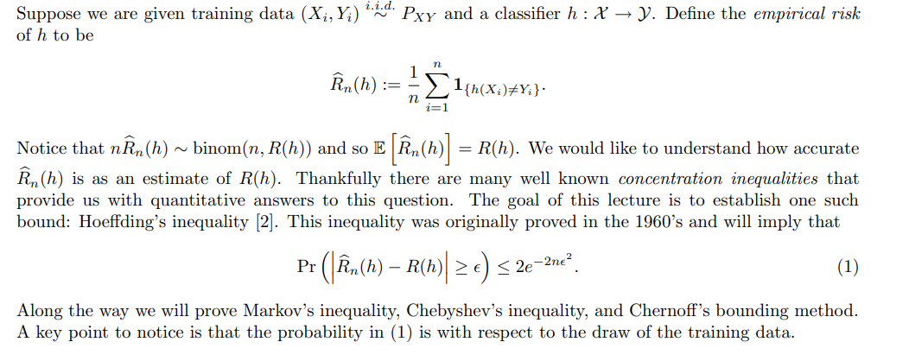
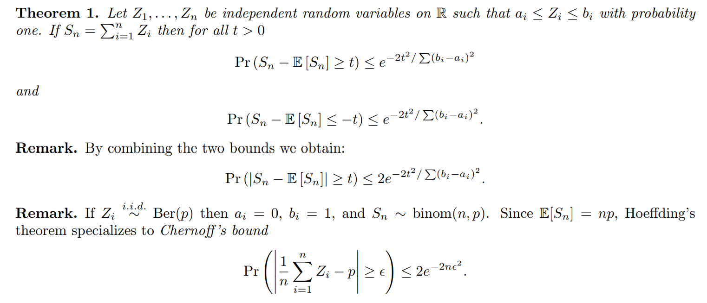

# 1. Definition

Khi xây dựng mô hình học máy, ta mong muốn sai số của mô hình với dữ liệu đã cho ban đầu là nhỏ nhất, nhưng điều quan trọng hơn là ta không chỉ muốn nó nhỏ trên tập training, test và cả validation, cái ta muốn là nó có khả năng ứng phó tốt trên mọi tập dữ liệu trên thực tế (Generalization).

Vì vậy ta hình thành công thức [4]:

$$
P[|Err_{test}(f_\theta) - Err_{real}(f_\theta)| > \epsilon] \leq 2 \exp(-2\epsilon^{2}N_{test}) \qquad(1)
$$

- Breakdown công thức một chút:
    - Mong muốn của chúng ta là sai số giữa độ lỗi trên tập test và thế giới thực $E = |Err_{test}(f_\theta) - Err_{real}(f_\theta)|$ phải là nhỏ nhất. Vì vậy, nếu gọi $\epsilon > 0$ là ngưỡng mà tại đó nếu sai số $E > \epsilon$ thì ta nói rằng mô hình hoạt động chưa đủ tốt trên dữ liệu thực tế.
    - Nhìn theo góc độ của xác suất, thì mong muốn của chúng ta tương đương với xác suất xảy ra hiện tượng mô hình hoạt động chưa đủ tốt trên tập dữ liệu thực tế phải được giảm thiểu (và nó phải nhỏ hơn một con số đủ nhỏ) hay nói cách khác $P(E > \epsilon) \leq  c$.
    - Bằng nhiều phương pháp đánh giá (chứng minh công thức ở mục [2]) ta đưa ra được $c =  2 \exp(-2\epsilon^{2}N_{test})$

# 2. Chứng minh

Giả sử mô hình đã được train xong và thu lại được bộ trọng số cố định $\theta$.

Ta rút một tập dữ liệu test có $N_{test}$ phần tử trong phân phối dữ liệu thực tế $\mathcal{D}$ thì với mỗi mẫu kiểm tra ngẫu nhiên $x_i$, ta có:

$$
z_i = \mathbb{I}[f_\theta(x_i) \ne y_i] = \begin{cases} 1 & \text{nếu thỏa điều kiện} \\ 0 & \text{nếu không thỏa điều kiện} \end{cases}
$$

$\mathbb{I}$ là một hàm chỉ thị, khi điều kiện $f_\theta(x_i) \ne y_i$ là đúng (tức là mô hình dự đoán sai tại điểm dữ liệu thứ $i$) thì giá trị của $z_i$ là 1. Ngược lại, nếu điều kiện là chưa đúng (tức là mô hình dự đoán đúng) thì giá trị của $z_i$ là 0.

Dễ thấy các biến $z_i$ là i.i.d và $z_i \in \{0, 1\}$.

Gọi $p$ là xác suất mô hình đưa ra dự đoán sai trên điểm dữ liệu $(x, y)$ bất kỳ trên thực tế.

$$
Err_{real} (f_\theta) = P(f_\theta(x) \neq y) = p \qquad(2)
$$

(Lý do ta dùng lại $p$ trong công thức tính $\mathbb{E}[z_i]$ sẽ được nêu sau thông qua ví dụ Bin Model).

Và vì $z_i \in \{0, 1\}$ nên dễ thấy $z_i$ tuân theo phân phối Bernoulli nên ta có:

$$
\mathbb{E}[z_i] = 1.P(z_i = 1) + 0.P(z_i = 0) = 1.p + 0.(1-p) = p = Err_{real}(f_\theta)
$$

Một chút về bất đẳng thức Hoeffding:

Source: [Hoeffding's Inequality](https://web.eecs.umich.edu/~cscott/past_courses/eecs598w14/notes/03_hoeffding.pdf)

Ta thấy nếu đặt các biến ngẫu nhiên độc lập $Z_i = z_i = \mathbb{I}[f_\theta(x_i) \neq y_i]$ với $i = 1, 2, \dots, N$ cùng nhận giá trị bị chặn trong khoảng $[0, 1]$, thì với trung bình mẫu $\bar{Z} = \frac{1}{N}\sum_{i=1}^{N}Z_i$ và kỳ vọng $\mu = \mathbb{E}[\bar{Z}] = \mathbb{E}[z_i] = p = Err_{real}[f_\theta]$, ta luôn có bất đẳng thức Hoeffding như sau:

$$
P[|\bar{Z} - \mu| > \epsilon] \leq 2\exp(-\frac{2N_{test}\epsilon^2}{(b-a)^{2}}) \qquad(3)
$$

Trong đó, $a = 0$ và $b = 1$, vậy thì $(a-b)^{2} = (0-1)^{2} = 1$, dẫn đến (3) tương đương

$$
P[|\bar{Z} - \mu| > \epsilon] \leq 2\exp(-\frac{2N_{test}\epsilon^2}{(b-a)^{2}}) = 2\exp(-2N_{test}\epsilon^2) \qquad(4)
$$

Trung bình số lần sai số đoán sai tập test hay $\bar{Z} = \frac{1}{N}\sum_{i=1}^{N}Z_i$ sẽ là sai số kiểm tra trên tập test ($Err_{test}$), nói cách khác:

$$
\bar{Z} = \frac{1}{N}\sum_{i=1}^{N}Z_i = Err_{test}(f_\theta)
$$

Kết hợp với $\mu = Err_{real}[f_\theta]$, và thay lên (4) ta được:

$$
P[|Err_{test}(f_\theta) - Err_{real}(f_\theta)| > \epsilon] \leq 2\exp(-2N_{test}\epsilon^2) \qquad(5)
$$

Hoàn tất chứng minh.

# 3. Các tính chất và ứng dụng của Hoeffding’s Inequality trong Machine Learning.
## 3.1. Giúp bỏ qua $Err_{real}$

Trong thực tế, rất khó xác định $Err_{real}$ nên dựa vào công thức (5), dễ thấy ta ko phải phụ thuộc vào nhiều vào việc phải đi tính $Err_{real}$ vì nó chỉ phụ thuộc vào 2 yếu tố chính là:

- $\epsilon$: Độ sai lệch tối đa chấp nhận được
- $N_{test}$: Kích thước tập dữ liệu kiểm tra

## 3.2. PAC (Probably Approximation Correct)

Bất đẳng thức Hoeffding sẽ cho biết phép ước lượng có thỏa mãn PAC hay không. [1]

Giả sử đặt mức rủi ro $\delta =  2\exp(-2\epsilon^{2}N_{test})$. Khi đó, với xác suất là $1-\delta$, ta có thể dự đoán $Err_{real}$ chỉ có thể nhận giá trị trong khoảng $\pm \epsilon$, hay

$$
\text{Err}_{\text{real}}(f_\theta) \in \left[\text{Err}_{\text{test}}(f_\theta) - \epsilon, \; \text{Err}_{\text{test}}(f_\theta) + \epsilon\right]
$$

(Liên hệ thêm thì bài toán này khá tương tự với Interval Estimation trong Statistical Inference - Casella) với:

- **Tham số quần thể (Population Parameter) chưa biết:** Sai số thực tế $\text{Err}_{\text{real}}$.
- **Thống kê mẫu (Sample Statistic) đo được:** Sai số trên tập test $\text{Err}_{\text{test}}$.
- **Sai số biên (Margin of Error):** Ngưỡng $\epsilon$.
- **Độ tin cậy (Confidence Level):** $1 - \delta$.
- **Khoảng ước lượng (Confidence Interval):** $[\text{Err}_{\text{test}} - \epsilon, \text{Err}_{\text{test}} + \epsilon]$.

Kiểu như với độ tin cậy là $1-\delta$ thì có thể ước lượng sai số thực tế của mô hình là bao nhiêu? Câu trả lời trong Interval Estimation là với độ tin cậy $1-\delta$ thì chắc chắn $Err_{real}$ sẽ rơi vào khoảng $\left[\text{Err}_{\text{test}}(f_\theta) - \epsilon, \; \text{Err}_{\text{test}}(f_\theta) + \epsilon\right]$

Làm rõ một chút:

- $\delta$ trong Interval Estimation là xác suất bốc tập test chưa đủ tốt (Probability of bad sample). Giải thích đơn giản thì nó là do có một số sample không phản ánh đúng thực tế, và sẽ có xác suất ta bốc trúng tập này, từ đó dễ ảnh hưởng tới kết luận chung.

Tuy là có một chút giống với Interval Estimation nhưng vẫn có tí khác biệt:

- Interval estimation thì thường dùng CLT để xây dựng khoảng tin cậy, dẫn tới số điểm dữ liệu phải là đủ lớn (vì ta cần phân phối của các điểm dữ liệu được quy về Gaussian Distribution).
- Ngược lại thì PAC là đúng với mọi kích thước tập và nó distribution-free.

## 3.3. Cung cấp công cụ ước lượng số lượng phần tử cho tập kiểm tra

Nếu muốn đảm bảo độ lệch không vượt quá $\epsilon = 0.05$ với độ tin cậy $99\%$ ($\delta = 0.01$):

$$
2\exp(-2(0.05)^2 N_{\text{test}}) \le 0.01 \implies N_{\text{test}} \ge \frac{\ln(2 / 0.01)}{2 \times 0.05^2} \approx 1060 \text{ mẫu}
$$

Chỉ cần chuẩn bị đủ $1060$ mẫu test độc lập thì về mặt toán học kết quả test có thể gần như là kết quả của thế giới thực mà không cần quan tâm gì về phân phối ẩn của $\text{Err}_{\text{real}}$.

# Other
## Bin Model

- Giả sử: ta có một thùng bi với rất nhiều viên bi (có thể hiểu thùng bi này là tập dữ liệu thực tế $\mathcal{D}$ trong ML)
- Ta mô hình hóa bài toán như sau:
    - Nếu mô hình đoán sai một điểm dữ liệu, ta coi điểm đó là bi đỏ. Ngược lại thì nếu mô hình đoán đúng một điểm dữ liệu, ta coi đó là bi xanh
    - Gọi tỷ lệ bi đỏ trong thùng là $p$ (hay nó cũng là $Err_{real}(f_\theta)$).
- Hành động bốc $N$ viên bi ngẫu nhiên (tất nhiên là có hoàn lại) trong thùng bi tương đương với bốc một mẫu ngẫu nhiên gồm $N$ phần tử từ phân phối dữ liệu thực tế $\mathcal{D}$.
- Vậy thì xác suất để bốc trúng bi đỏ (hay xác suất để mô hình đưa ra dự đoán trên một điểm dữ liệu là sai $P(z_i = 1)$) phải bằng $p$.

## Dicussion

> **Lưu ý:** Bất đẳng thức này **chỉ đúng khi tập test không tham gia vào quá trình huấn luyện** (kể cả việc chọn hyperparameter). Nếu dùng công thức này cho $\text{Err}_{\text{train}}$, bất đẳng thức sẽ sai do hiện tượng tối ưu hóa (data snooping), khi đó phải sử dụng chặn phức tạp hơn như **VC-dimension** hoặc **Rademacher Complexity** để bù đắp cho không gian giả thuyết $\mathcal{H}$[1].
> 

(Xem cái này thì sang PAC-learning theory)

# References
[1]: Foundation of Machine Learning - MIT

[2]: Pattern Recognition and Machine Learning - Christopher Bishop

[3]: Statistical Inference - Casella

[4]: Hoeffding’s Inequality https://web.eecs.umich.edu/~cscott/past_courses/eecs598w14/notes/03_hoeffding.pdf
