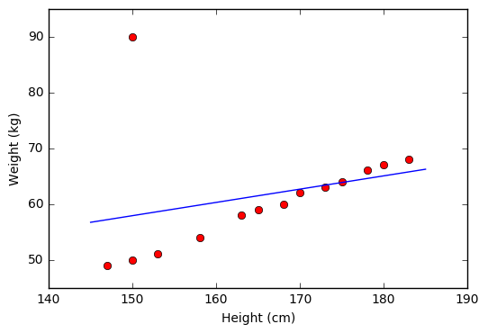
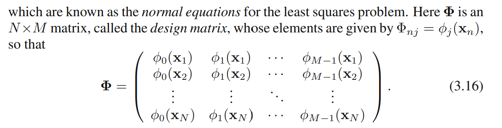
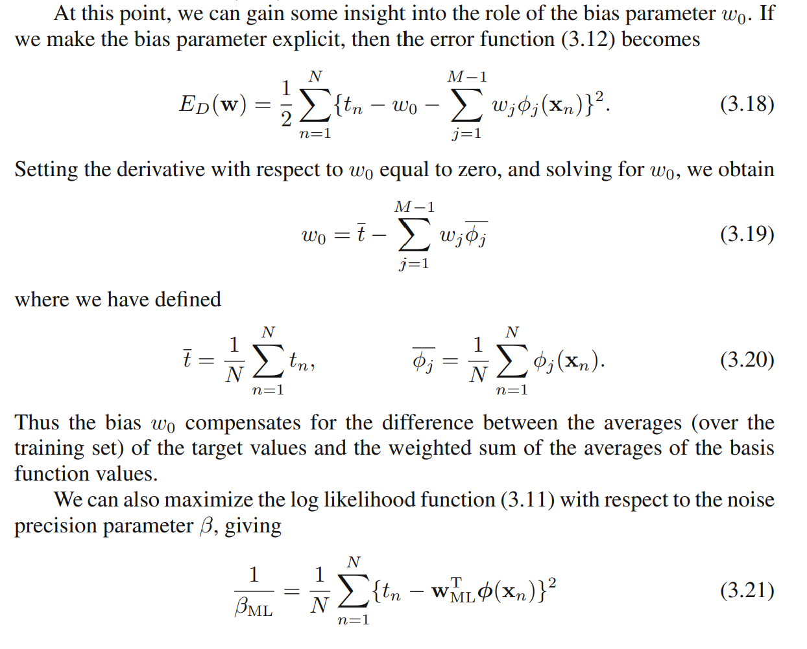

https://colab.research.google.com/drive/1bjQdcn3vNGezsYffv-Ikk1pA0PFQ7Kdp#scrollTo=Zpz484N7X5l7

- The code above is an easy code example for linear regression in ML
- Giải thích từng dòng code:
    - `X = 2 * np.random.rand(m, 1)`:  `np.random.rand(m, 1)` là thuật toán sinh số ngẫu nhiên và form chúng thành một np.array có dạng `m x 1` (column vector). Lý do nhân thêm 2 chỉ để lúc plot lên đồ thị sẽ thấy các điểm dữ liệu trải đều từ [0, 2].
    - `y = 4 + 3 * X + np.random.randn(m, 1)`: this is equivalent to the function f(x) = theta_0 + theta_1*X + epsilon, with epsilon = noise. Trong machine learning, noise luôn được giả định sẽ tuân theo phân phối chuẩn, nên ở đây ta sử dụng randn để lấy ra noise

# 1. Lý thuyết

Linear regression là một thuật toán máy học cơ bản và đơn giản nhất trong machine learning. Đây là một thuật toán Supervised Learning.

## 1.1 Simple linear regression

$$
\hat{y} = w_0 + w_1x
$$

- $w_0, w_1$ là các tham số (trọng số) cần tìm
- $x$ là điểm dữ liệu (input variable) hay còn được gọi là đặc trưng (feature)
- $\hat{y}$ là giá trị dự đoán có được từ model

Đây là dạng Linear regression đơn giản nhất với chỉ một biến (hay một đặc trưng). Việc tinh chỉnh các tham số $w_0, w_1$ là tương đối đơn giản trong ví dụ này.

## 1.2. Multiple Linear Regression

$$
\hat{y} = w_0 + w_1x_1 + \dots + w_dx_d = \mathbf{\bar{x}}^{T}\mathbf{\bar{w}}
$$

Trong đó,

- $\mathbf{x} = \begin{bmatrix}x_1 & x_2 & \dots & x_d\end{bmatrix} ^{T}\in \mathcal{R}^{d}$ .
- $x_i$ là đặc trưng thứ $i$.
- $\mathbf{w} =  \begin{bmatrix}w_1 & w_2 & \dots & w_d\end{bmatrix}^{T} \in \mathcal{R}^{d}$
- Thông thường ta có thêm hệ số tự do là $w_0$ (thường được gọi là bias) để điều chỉnh thuật toán tốt hơn và fit với dữ liệu nhiều hơn, từ đó sinh ra cách kí hiệu mới như sau:
    - $\mathbf{\bar{x}} = \begin{bmatrix}1 & x_1 & x_2 & \dots & x_d\end{bmatrix} ^{T}$
    - $\mathbf{\bar{w}} =  \begin{bmatrix}w_0 & w_1 & w_2 & \dots & w_d\end{bmatrix}^{T}$

Việc thêm một đặc trưng mới với  dữ liệu cố định = 1 trong vector đặc trưng $\mathbf{x}$ có ý nghĩa tối ưu lớn (sẽ tìm hiểu sau) 

## 1.3. Loss function

- Loss function được định nghĩa là sai khác giữa dự liệu dự đoán $\hat{y}$ với dữ liệu thực tế là $y$. Nếu sự sai khác là rất lớn → Cần điều chỉnh lại.
- Với $N$ cặp dữ liệu $\mathcal{D} = \{(\mathbf{x_i}, y_i)\}_{i=1}^{N}$ , ta có:

$$
\mathcal{L}(\mathbf{w}) = \frac{1}{2N}\sum_{i = 1}^{N}(y_i - \mathbf{\bar{x}}_{i}^{T}\mathbf{w})^{2} = \frac{1}{2N} \left\lVert y - \mathbf{\bar{X}}\mathbf{w} \right\rVert_2^{2}
$$

- Với $\mathbf{y} = \begin{bmatrix}y_1 & y_2 & \dots & y_N\end{bmatrix}^{T}$ , $\mathbf{\bar{X}} = \begin{bmatrix}\mathbf{\bar{x_1}^{T}} \\ \mathbf{\bar{x_2}}^{T} \\\dots\\ \mathbf{\bar{x_N}}^{T}\end{bmatrix}$.
- Rõ ràng, sai số càng nhỏ thì chứng tỏ model hoạt động càng tốt, vậy loss function cần phải càng nhỏ càng tốt → Tối thiểu hóa Loss function $\mathcal{L}$.

$$
\mathbf{w}^{*} = \arg\min_{w}\mathcal{L}(\mathbf{w})
$$

- Lấy gradient của $\mathcal{L}$, ta có:

$$
\frac{\nabla{\mathcal{L}(\mathbf{w})}}{\nabla{\mathbf{w}}} = \frac{1}{N} \mathbf{\bar{X}}^{T}(\mathbf{\bar{X}}\mathbf{w} - \mathbf{y}) = 0 \Leftrightarrow \mathbf{w} = (\mathbf{\bar{X}}^{T}\mathbf{\bar{X}})^{-1}\mathbf{\bar{X}}^{T}\mathbf{y} \qquad (1)
$$

Tuy nhiên, không phải lúc nào tích $\mathbf{\bar{X}}^{T}\mathbf{\bar{X}}$ cũng khả nghịch, vì vậy ta viết lại một cách tổng quát hơn cho công thức  (1) thông qua giả nghịch đảo như sau:

$$
\mathbf{w} = (\mathbf{\bar{X}}^{T}\mathbf{\bar{X}})^{\dagger}\mathbf{\bar{X}}^{T}\mathbf{y} \qquad (2)
$$

Lưu ý:

- Công thức (2) thường được gọi là closed-form equation hay normal equation
- Tuy đã có công thức (2) tính toán cho $\mathbf{w}$ trong trường hợp tổng quát, nhưng thông thường ta ít dùng tới công thức này vì độ phức tạp trong quá trình nhân ma trận lên tới $O(N^{2})$ , dẫn tới việc tính toán cần nhiều tài nguyên.
- Vì vậy, ta thường sử dụng thuật toán tối ưu hóa khác (như Gradient Descent hay NAG, Adam,…) để tối ưu hóa các hàm loss thay vì sử dụng phép nhân ma trận như trên.

# 2. Code

https://colab.research.google.com/drive/1BZqX7KqpMV8NKmAMv8tKCtPlu5X-B1Rb

https://colab.research.google.com/drive/1WUS88msNTciGO2gC3c9R5kx9EksRMy5Y

# 3. Dicussion

## 3.1. Các bài toán có thể giải bằng Linear Regression

Hàm số $\hat{y} =  \mathbf{w}^{T}\mathbf{x}$ là một hàm tuyến tính theo $\mathbf{x}$ và $\mathbf{w}$. Trên thực tế ta có thể áp dụng cho các mô hình chỉ cần tuyến tính theo $\mathbf{w}$ là đủ. Ví dụ:

$$
y \approx w_1x_1+w_2x_2+w_3x_1^{2}+w_4 \sin(x_2)+w_5x_1x_2+w_0
$$

là một hàm tuyến tính theo $\mathbf{w}$ và vì vậy cũng có thể được giải bằng Linear Regression. Với mỗi  điểm dữ liệu đầu vào $\mathbf{x} = \begin{bmatrix}x_1 & x_2\end{bmatrix}^{T}$ , chúng ta tính toán dữ liệu mới (tạo thành nhiều cột mới hơn) $\tilde{\mathbf{x}} =  \begin{bmatrix}x_1 & x_2 & x_1^{2} &\sin{x_2} & x_1x_2\end{bmatrix}^{T}$ rồi áp dụng Linear Regression với dữ liệu mới này.

Đây cũng là ý tưởng chung cho nhiều bài toán khác (như polynomial regression).

- Đôi khi trong nhiều giáo trình, ta sử dụng phương pháp kí hiệu khác để nói rằng nhiều bài toán  có thể giải bằng Linear Regression bằng cách đưa tính phi tuyến vào dữ liệu đầu vào, từ đó giúp mô hình fit với dữ liệu hơn, đó là kí hiệu của **Basis Function** ($\phi{(\mathbf{x}})$) như sau:

$$
y \approx \hat{y} = y(\mathbf{x}, \mathbf{w}) = w_0 + \sum_{j = 1}^{M - 1}w_j\phi_j(\mathbf{x}) \qquad(3.1.1)
$$

Trong đó, $\phi{\mathbf{(x)}}$ là basis function. Ta định nghĩa thêm một hàm cơ sở giả (dummy basis function) là $\phi_0{\mathbf{(x)}} = 1$ để tối ưu hóa biểu diễn toán học. Theo đó, công thức (3.1.1) được viết lại như sau:

$$
y \approx \hat{y} = y(\mathbf{x}, \mathbf{w}) = w_0 + \sum_{j = 1}^{M - 1}w_j\phi_j(\mathbf{x}) = \mathbf{w}^{T}\mathbf{\phi(x)}
$$

Với $M$ là tổng số lượng tham số của mô hình sau khi biểu chuyển đổi sang tập dữ liệu mới, kí hiệu lại như sau:

$\mathbf{w} =  \begin{bmatrix}w_0 & w_1 & w_2 & \dots & w_{M-1}\end{bmatrix}^{T}$

$\mathbf{\phi} = \begin{bmatrix}\phi_0 & \phi_1 & \phi_2 & \dots & \phi_{M-1}\end{bmatrix}^{T}$

Basis Function là gì?

Basis function (hàm cơ sở) là phương pháp toán học để nâng cấp sức mạnh cho mô hình hồi quy bằng cách đưa tính phi tuyến vào dữ liệu đầu vào mà vẫn giữ nguyên lợi thế tối ưu hóa của các mô hình tuyến tính.

Vai trò của Basis Function:

- Basis function $\phi_j(\mathbf{x})$ được giới thiệu như một hàm phi tuyến cố định (fixed nonlinear function) dùng để biến đổi trực tiếp các biến đầu vào $\mathbf{x}$.
- Vai trò của nó là mở rộng lớp mô hình (class of models) bằng cách sử dụng tổ hợp tuyến tính của các hàm phi tuyến này, cho phép mô hình học được các mối quan hệ cong, phức tạp thay vì chỉ vẽ các đường thẳng.
- Tính chất này quan trọng là vì hàm số vẫn giữ nguyên tính tuyến tính đối với trọng số $w_i$ và có thể giúp hàm số hội tụ nhanh y hệt linear regression.

Bài toán được đưa ra ở (3.1) là một phương pháp sử dụng basis function để ánh xạ tập dữ liệu đầu vào ban đầu thành tập dữ liệu mới có tính phi tuyến.

## 3.2. Hạn chế của Linear regression

Hạn chế đầu tiên của Linear Regression là nó rất **nhạy cảm với nhiễu** (sensitive to noise). Trong ví dụ về mối quan hệ giữa chiều cao và cân nặng bên trên, nếu có chỉ một cặp dữ liệu *nhiễu* (150 cm, 90kg) thì kết quả sẽ sai khác đi rất nhiều. Xem hình dưới đây:

Vì vậy, trước khi thực hiện Linear Regression, các nhiễu (*outlier*) cần phải được loại bỏ. Bước này được gọi là tiền xử lý (pre-processing).

Hạn chế thứ hai của Linear Regression là nó **không biễu diễn được các mô hình phức tạp**. Mặc dù trong phần trên, chúng ta thấy rằng phương pháp này có thể được áp dụng nếu quan hệ giữa *outcome* và *input* không nhất thiết phải là tuyến tính, nhưng mối quan hệ này vẫn đơn giản nhiều so với các mô hình thực tế. Hơn nữa, chúng ta sẽ tự hỏi: làm thế nào để xác định được các hàm $x_1^{2},\sin(x_2),x_1x_2$ như ở trên?

# 4. MLE cho Linear Regression

Trong phần này sẽ sử dụng các phương pháp XSTK để xác định cơ sở xây dựng MSE của Linear Regression.

Bản chất của việc minimize hàm MSE chính là tiếp cận bài toán point estimation theo phương pháp maximum likelihood estimation với giả định noise $\varepsilon$ tuân theo phân phối chuẩn Gauss

As before, we assume that the target variable $t$ is given by a deterministic function $y(x, w)$ with additive Gaussian noise so that

$$
t = y(\mathbf{x}, \mathbf{w}) + \varepsilon
$$

where  $\varepsilon$ is a **zero mean Gaussian random variable** with precision (inverse variance) $\beta$, or 

$$
\varepsilon \sim \mathcal{N}(0, \sigma^{2}) = \mathcal{N}(0, \beta^{-1})
$$

Then, we calculate the mean and variance of each target value $t$

$$
\mathbb{E}[t | \mathbf{x}, \mathbf{w}] = \mathbb{E}[y(\mathbf{x}, \mathbf{w}) + \epsilon | \mathbf{x}, \mathbf{w}] = \mathbb{E}[y(\mathbf{x}, \mathbf{w}) | \mathbf{x}, \mathbf{w}] + \mathbb{E}[\epsilon] = y(\mathbf{x}, \mathbf{w}) + 0 = y(\mathbf{x}, \mathbf{w})
$$

$$
\text{Var}[t | \mathbf{x}, \mathbf{w}] = \text{Var}[y(\mathbf{x}, \mathbf{w}) + \epsilon | \mathbf{x}, \mathbf{w}] = \text{Var}[y(\mathbf{x}, \mathbf{w}) | \mathbf{x}, \mathbf{w}] + \text{Var}[\epsilon] = 0 + \sigma^2 = \beta^{-1}
$$

As a result

$$
t \sim \mathcal{N}(y(\mathbf{x}, \mathbf{w}), \beta^{-1})
$$

Thus we can write

$$
p(t|\mathbf{x}, \mathbf{w}, \beta)  =  \mathcal{N}(t|y(\mathbf{x}, \mathbf{w}), \beta^{-1})
$$

Denote that $\mathbf{t} = \begin{bmatrix}t_1 & t_2 & \dots t_N\end{bmatrix}^{T}$ is the target values vector with corresponding a data set of $N$ inputs $\mathbf{X} = \{\mathbf{x_1}, \mathbf{x_2}, \dots, \mathbf{x_N}\}$

$$
p(\mathbf{t}|\mathbf{X}, \mathbf{w}, \beta) = p(\mathbf{t}|\mathbf{w}, \beta) =\prod_{n = 1}^{N} {\mathcal{N}(t_n|\mathbf{w}^{T}\mathbf{\phi(x_n)}, \beta^{-1})}
$$

Taking the logarithm of the likelihood function:

$$
\ln{p(\mathbf{t}| \mathbf{w}, \beta)} = \sum_{n = 1}^{N}{\ln \mathcal{N}(t_n|\mathbf{w}^{T}\mathbf{\phi(x_n)}, \beta^{-1})} = \frac{N}{2} \ln \beta - \frac{N}{2} \ln (2\pi) - \beta E_D(\mathbf{w})
$$

where the sum-of-squares error function is defined by

$$
E_D(\mathbf{w}) = \frac{1}{2} \sum_{n=1}^{N}(t_n - \mathbf{w}^{T}\mathbf{\phi}(\mathbf{x_n}))^{2}
$$

Solving $\mathbf{w}$ (normal equation)

$$
\mathbf{w}_{ML} = (\Phi^{T}\Phi)^{\dagger}\Phi^{T}\mathbf{t}
$$

where $\Phi$ is defined

Rõ ràng:

- Ban đầu ta assume rằng noise $\varepsilon \sim \mathcal{N}(0, \beta^{-1})$, do vậy ta còn một tham số cần ước lượng nữa đó là $\beta$ và được tính bằng công thức (3.21) (Chứng minh công thức ở dưới).
- Ý nghĩa từ công thức: phương sai của nhiễu bằng đúng trung bình bình phương sai số (MSE) của tập huấn luyện sau khi đã tối ưu trọng số. Hay nói cách khác thì phương sai của nhiễu đúng bằng trung bình bình phương phần dư (residual) theo góc nhìn giải tích, nhưng nhìn theo góc nhìn thống kê sẽ thấy nó chính là sample variance của $\varepsilon$. Giải thích:
    - Rất dễ thấy rằng $t = y(\mathbf{x}, \mathbf{w})   + \varepsilon$ là một random variable, và do vậy tương ứng với mỗi $t$ ta có một phần noise mà ta assume phân phối như sau:
        
$$
\varepsilon \sim \mathcal{N}(0, \beta^{-1})
$$
        
    - Dẫn đến với $N$ giá trị đích $t$ ta có tới $N$ noise là $\varepsilon_1, \dots, \varepsilon_N$ đều i.i.d (independent identically distribution) vì các dữ liệu trong tập dữ liệu ban đầu được thu thập một cách độc lập.
    - Vì vậy ta thấy:
        
$$
Var(\varepsilon) = E[\varepsilon^{2}] - E[\varepsilon]^{2} = E[\varepsilon^{2}] \approx \frac{1}{N}(\sum_{i=1}^{N}\varepsilon_i^{2})
$$
        
        - Dấu bằng cuối cùng chỉ xảy ra theo luật số lớn khi số lượng quan sát được $N$ càng lớn. Vì vậy trung bình của $\varepsilon_i^{2}$ có thể được coi như là một giá trị thực nghiệm ước lượng $E[\varepsilon^{2}]$ (hay trong trường hợp này trung bình này cũng chính là phương sai/mức độ biến động của $\varepsilon$).
    - Mà ta lại có
        
$$
\varepsilon = t - y(\mathbf{x}, \mathbf{w})  
$$
        
$$
\Rightarrow Var(\varepsilon) = E[\varepsilon^{2}] = E[(t - y(\mathbf{x}, \mathbf{w}))^{2}]
$$
        

Vì vậy ta thấy kết luận cuối cùng của C.Bishop là hoàn toàn đúng ”we see that the inverse of the noise precision is given by the residual variance of the target values around the regression function”

Chứng minh (3.21):

ta có:

$$
\ln{p(\mathbf{t}| \mathbf{w}, \beta)} = \sum_{n = 1}^{N}{\ln \mathcal{N}(t_n|\mathbf{w}^{T}\mathbf{\phi(x_n)}, \beta^{-1})} = \frac{N}{2} \ln \beta - \frac{N}{2} \ln (2\pi) - \beta E_D(\mathbf{w})
$$

Giả sử ở bước này, ta đã tìm được bộ trọng số tối ưu $\mathbf{w}_{ML}$

$$
\Rightarrow \frac{\partial \ln p}{\partial \beta} = \frac{N}{2\beta} - E_D(\mathbf{w}_{ML}) = 0
$$

$$
\Rightarrow\frac{1}{\beta_{ML}} = \frac{1}{N} \sum_{n=1}^{N} \{t_n - \mathbf{w}_{ML}^T \phi(\mathbf{x}_n)\}^2
$$

# 5. Linear Regression dưới góc độ Giải tích và Đại số tuyến tính

Dưới góc độ này, ta không giả sử nhiễu tuân $\epsilon$ theo phân phối chuẩn nữa.

Vậy ta nhìn như sau:

Nếu gọi $X$ là một ma trận được xây dựng từ các feature vector sắp theo hàng ngang, từ đó ta có:

$$
\hat{\mathbf{y}} = X\mathbf{w}
$$

Có thể thấy được $\hat{y}$ chính là một vector nằm trong column space của $X$ (xem như một hyperplane), việc của ta lúc này chính là điều chỉnh vector trọng số $\mathbf{w}$ sao cho $\hat{\mathbf{y}}$ có khoảng cách là ngắn nhất với vector mục tiêu $\mathbf{y}$ (đây là vector mà ta cần dự đoán, và về bản chất thì nó ko nằm trong hyperplane được tạo bởi column space của $X$) nhất có thể .

Ở đây nếu ta gọi $\mathbf{e} = \mathbf{y} - \hat{\mathbf{y}} = \mathbf{y} - X\mathbf{w}$ (hoặc ngược lại đều được), ta sẽ thấy đây là một vector cột $(N \times 1)$ và cũng đồng thời là vector sai số giữa 2 vector $\mathbf{y}$ và $\hat{\mathbf{y}}$ ma ta đang cần tối thiểu hóa

Dễ thấy thì để $\mathbf{e}$ là nhỏ nhất thì vector sai số này phải vuông góc với hyperplane được tạo từ các cột của ma trận X. Nói cách khác thì

$$
X^Te = 0 \Leftrightarrow X^T(\mathbf{y} - X\mathbf{w}) = 0 \Leftrightarrow \mathbf{w} = (X^TX)^{\dag}X^Ty
$$

Vậy thì dù nhìn dưới góc độ nào thì ta cũng đều thu được một kết quả là Normal Equation.

# References
[1]: [Machine Learning co ban with Vu Huu Tiep](https://machinelearningcoban.com/2016/12/28/linearregression/)  

[2]: Pattern Recognition and Machine Learning  - Christopher Bishop
